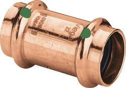
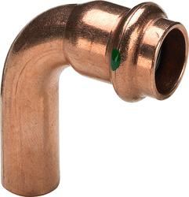
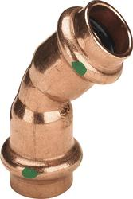
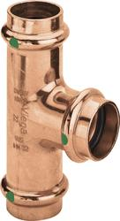
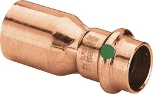
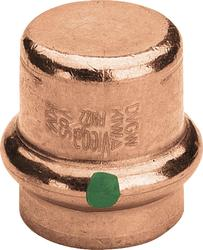
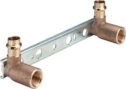
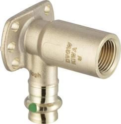

# Benötigtes Material

**Danke Frank,
hier die Auflistung der verwendeten Materialien:**
 
 

| Bild | Beschreibung      | Anzahl |
| ----------- | ----------- | ----------- |
| | Gerade Muffe zwei Pressungen | _Ø15_: **2** _Ø18_: **1** |
| | 90° Muffe eine Pressung | _Ø15_: **7** |
|| 90° Muffe zwei Pressungen | _Ø15_: **13** |
|| 45° Muffe einer Pressung | _Ø15_: **7** |
|| 45° Muffe zwei Pressungen | _Ø15_: **3** |
|| T-Muffe | _Ø15,15,15_: **3** _Ø18,15,15_: **3** |
|| Reduzierung | _Ø18->15: **1** |
|| Kappe | _Ø18: **2** |
|| Doppel Wasseranschluss | _Ø15: **2** |
|| Einfach Wasseranschluss | _Ø15: **2** |
|| Rohrschelle | _Schelle_: **14** _kurzes Gewinde_: **14** _kurze Schraube_: **14** _Dübel_: **14** |

 
"Abfall-Kupferrohre" komplett verarbeitet.
 
### Hier noch ein paar Bilder wie es aussieht:

